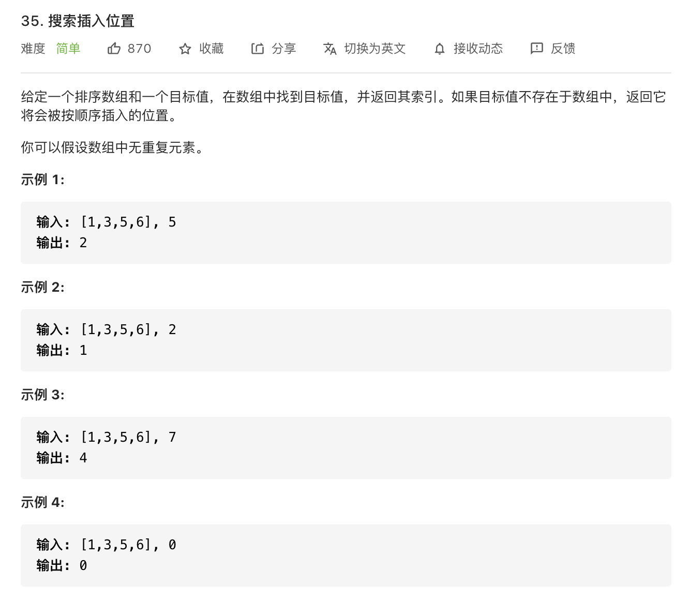
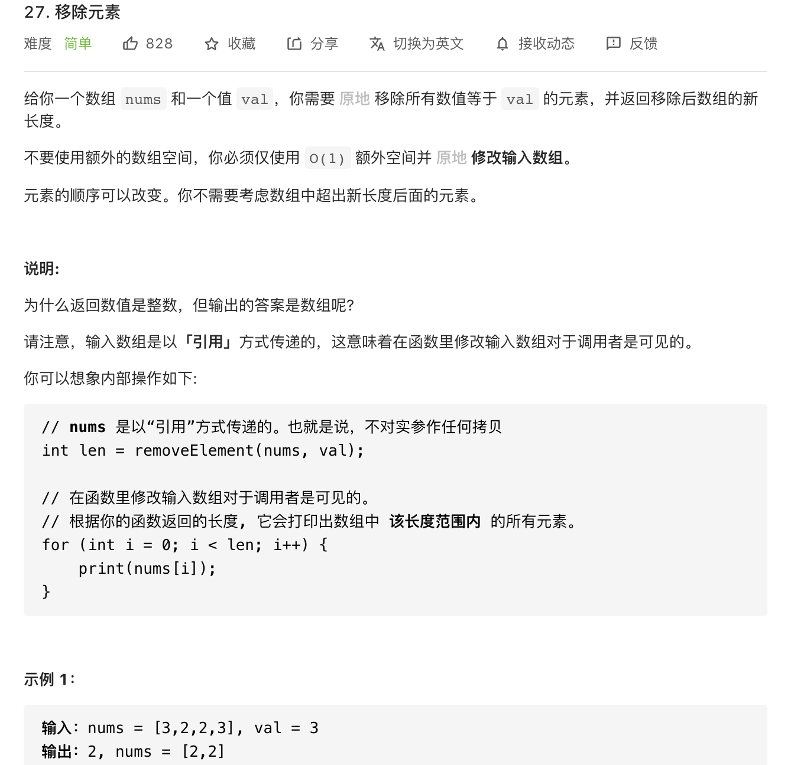

<!--
 * @Author: yinzhicun
 * @Date: 2021-04-04 09:36:07
 * @LastEditTime: 2021-04-04 11:24:40
 * @LastEditors: Please set LastEditors
 * @Description: In User Settings Edit
 * @FilePath: /Leetcode_Note/data_structure/note_array.md
-->

# <center>数组习题</center>

## 一、一般数组

### 1. 搜索
#### 1.1 二分排序

  - 暴力法求解，时间复杂度为 **O(n)** 

    ```
    class Solution {
    public:
        int searchInsert(vector<int>& nums, int target) 
        {
            //记录target在数组中的位置
            int target_index = 0;

            for (int i = 0; i < nums.size(); i++)
            {
                if (nums[i] == target)
                    return i;
                else
                {
                    if (nums[i] < target)
                        target_index ++;
                }
            }
            return target_index;
        }
    };
    ```
  - 二分法求解，时间复杂度为 **O(log n)**

    ```
    class Solution {
    public:
        int searchInsert(vector<int>& nums, int target) 
        {
            //初始化，设定区间为左闭右开区间,此为循环不变量
            int left = 0;
            int right = nums.size();
            int middle;

            while (left < right)
            {
                middle = (left + right) / 2;
                if (nums[middle] == target)
                    return middle;
                else if (nums[middle] < target)
                    left = middle + 1;
                else
                    right = middle;
            }
            // 分别处理如下四种情况
            // 目标值在数组所有元素之前 [0,0)
            // 目标值等于数组中某一个元素 return middle
            // 目标值插入数组中的位置 [left, right) ，return right 即可
            // 目标值在数组所有元素之后的情况 [left, right)，return right 即可
            return right;
        }
    };
    ```

#### 1.2 数组里的双指针法

  - 暴力法求解，时间复杂度为 **O(n^2)** 

    ```
    class Solution {
    public:
        int removeElement(vector<int>& nums, int val) 
        {
            int size = nums.size();

            for (int i = 0; i < size; i++)
            {
                if (nums[i] == val)
                {
                    for (int j = i; j < size - 1; j++)
                    {
                        nums[j] = nums[j + 1];
                    }
                    size--;
                    //因为移动了一个元素，所以要回退一个进行比较
                    i--;
                }
            }
            return size;
        }
    };
    ```

  - 双指针法求解，时间复杂度为 **O(n)**

    ```
    class Solution {
    public:
        int removeElement(vector<int>& nums, int val) 
        {
            int slow_index = 0;
            int fast_index = 0;
            for (; fast_index < nums.size(); fast_index++)
            {   
                if (nums[fast_index] != val)
                {
                    nums[slow_index] = nums[fast_index];
                    slow_index++;
                }
            }
            return slow_index;
        }
    };
    ```