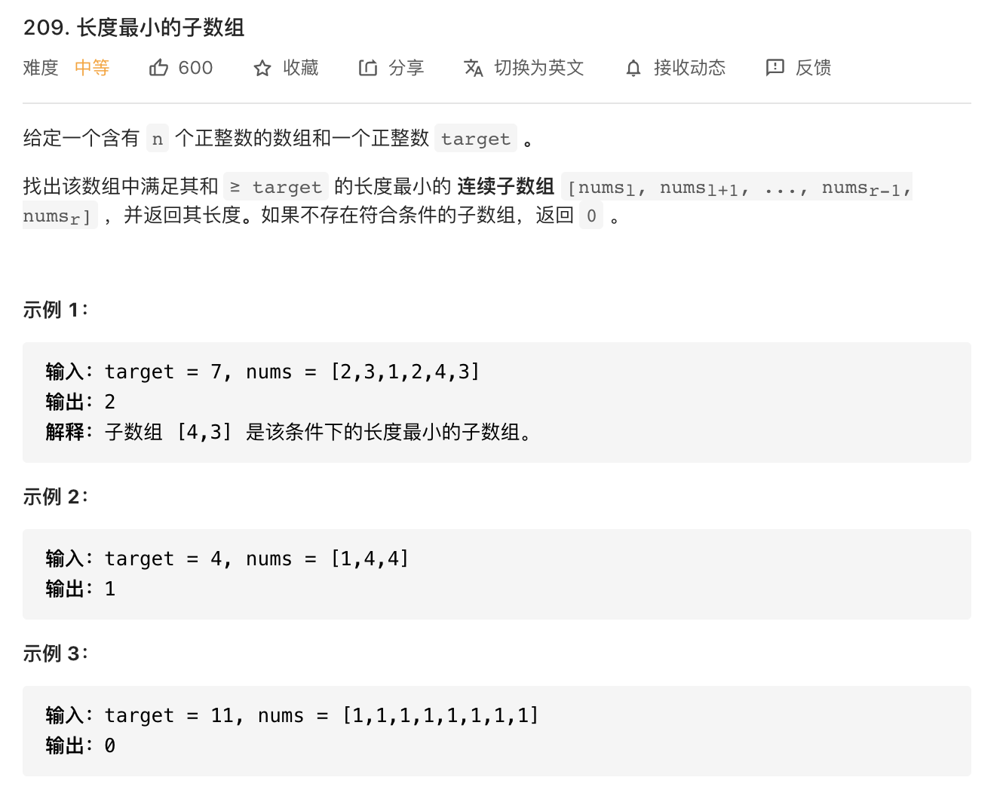

<!--
 * @Author: yinzhicun
 * @Date: 2021-04-04 09:36:07
 * @LastEditTime: 2021-04-04 15:17:41
 * @LastEditors: Please set LastEditors
 * @Description: In User Settings Edit
 * @FilePath: /Leetcode_Note/data_structure/note_array.md
-->

# <center>数组习题</center>

## 一、一般数组

### 1. 搜索
#### 1.1 二分排序

- 暴力法求解，时间复杂度为 **O(n)** ，空间复杂度为 **O(1)**

> 1. 循环搜索
> 2. 搜索的同时比较大小判定target在数组中的位置

```cpp
class Solution {
public:
    int searchInsert(vector<int>& nums, int target) 
    {
        //记录target在数组中的位置
        int target_index = 0;
        for (int i = 0; i < nums.size(); i++)
        {
            if (nums[i] == target)
                return i;
            else
            {
                if (nums[i] < target)
                    target_index ++;
            }
        }
        return target_index;
    }
};
```

- 二分法求解，时间复杂度为 **O(log n)**，空间复杂度为 **O(1)**
> 二分查找，关键在于抓住循环不变量，一法为左闭又开区间，二法为闭区间

```cpp
//法1
class Solution {
public:
    int searchInsert(vector<int>& nums, int target) 
    {
        //初始化，设定区间为左闭右开区间,此为循环不变量
        int left = 0;
        int right = nums.size();
        int middle;
        while (left < right)
        {
            middle = (left + right) / 2;
            if (nums[middle] == target)
                return middle;
            else if (nums[middle] < target)
                left = middle + 1;
            else
                right = middle;
        }
        // 分别处理如下四种情况
        // 目标值在数组所有元素之前 [0,0)
        // 目标值等于数组中某一个元素 return middle
        // 目标值插入数组中的位置 [left, right) ，returnright 即可
        // 目标值在数组所有元素之后的情况 [left, right)returnright 即可
        return right;
    }
};

//法2
class Solution {
public:
    int searchInsert(vector<int>& nums, int target) 
    {
        //初始化，设定区间为闭区间,此为循环不变量
        int left = 0;
        int right = nums.size() - 1;
        int middle;
        while (left <= right)
        {
            middle = (left + right) / 2;
            if (nums[middle] == target)
                return middle;
            else if (nums[middle] < target)
                left = middle + 1;
            else
                right = middle - 1;
        }
        return left;
    }
};
```

#### 1.2 数组里的双指针法
##### 1.2.1 删除元素

- 暴力法求解，时间复杂度为 **O(n^2)** ，空间复杂度为 **O(1)**
> 1. 循环搜索
> 2. 每当出现需要删除元素时，将其删除，并将数组后面部分前移一位
> 3. 由于数组元素移动，指针不变，在同一个位置比较新改动的元素后再继续移动

```cpp
class Solution {
public:
    int removeElement(vector<int>& nums, int val) 
    {
        int size = nums.size();
        for (int i = 0; i < size; i++)
        {
            if (nums[i] == val)
            {
                for (int j = i; j < size - 1; j++)
                {
                    nums[j] = nums[j + 1];
                }
                size--;
                //因为移动了一个元素，所以要回退一个进行比较
                i--;
            }
        }
        return size;
    }
};
```

- 双指针法求解，时间复杂度为 **O(n)**，空间复杂度为 **O(1)**
> 1. 快指针与慢指针一起移动
> 2. 当快慢指针遇到指定删除元素时，慢指针不动，快指针移动，直到越过需要删除元素
> 3. 从快指针指向的第一个元素开始，其移到慢指针所指之处

```cpp
class Solution {
public:
    int removeElement(vector<int>& nums, int val) 
    {
        int slow_index = 0;
        int fast_index = 0;
        for (; fast_index < nums.size(); fast_index++)
        {   
            if (nums[fast_index] != val)
            {
                nums[slow_index] = nums[fast_index];
                slow_index++;
            }
        }
        return slow_index;
    }
};
```

##### 1.2.1 滑动窗口

- 暴力法求解，时间复杂度为 **O(n^2)** ，空间复杂度为 **O(1)**
> 1. 循环搜索
> 2. 每一次大循环中对后续子序列进行顺序加和比较
> 3. 当满足大于等于target的条件后，取最小长度

```cpp
class Solution {
public:
    int minSubArrayLen(int target, vector<int>& nums) 
    {
        int result = INT32_MAX; // 最终的结果
        int sum = 0; // 子序列的数值之和
        int subLength = 0; // 子序列的长度
        for (int i = 0; i < nums.size(); i++) 
        { // 设置子序列起点为i
            sum = 0;
            for (int j = i; j < nums.size(); j++) 
            { // 设置子序列终止位置为j
                sum += nums[j];
                if (sum >= target) 
                { // 一旦发现子序列和超过了s，更新result
                    subLength = j - i + 1; // 取子序列的长度
                    result = result < subLength ? result : subLength;
                    break; // 因为我们是找符合条件最短的子序列，所以一旦符合条件就break
                }
            }
        }
        // 如果result没有被赋值的话，就返回0，说明没有符合条件的子序列
        return result == INT32_MAX ? 0 : result; 
    }
};
```

- 双指针法求解，时间复杂度为 **O(nlogqn)**，空间复杂度为 **O(1)**
> 1. 慢指针先不动，快指针移动
> 2. 窗口元素之和（即快慢指针之间的元素和）大于等于target时，快指针不动，慢指针迁移，实时记录长度
> 3. 当到不满足条件后，快指针继续移动
> 4. 实际运用了动态规划的思想

```cpp
class Solution {
public:
    int minSubArrayLen(int target, vector<int>& nums) 
    {
        int slow_index = 0;
        int fast_index = 0;
        int sum = 0;
        int length = INT_MAX;
        for ( ; fast_index < nums.size(); fast_index++)
        {   
            sum = sum + nums[fast_index];
            while (sum >= target)
            {
                sum = sum - nums[slow_index];
                slow_index++;
                length = length > (fast_index - slow_index + 2) ? (fast_index - slow_index + 2) : length;
            }
        }
        return length == INT_MAX ? 0 : length;
    }
};
```