<!--
 * @Author: yinzhicun
 * @Date: 2021-04-18 10:08:24
 * @LastEditTime: 2021-04-27 20:30:29
 * @LastEditors: Please set LastEditors
 * @Description: In User Settings Edit
 * @FilePath: /Leetcode_Note/data_structure/note_btree.md
-->
# <center>二叉树习题</center>

## 一、二叉树的遍历
四种遍历方式
### 1. 前序遍历
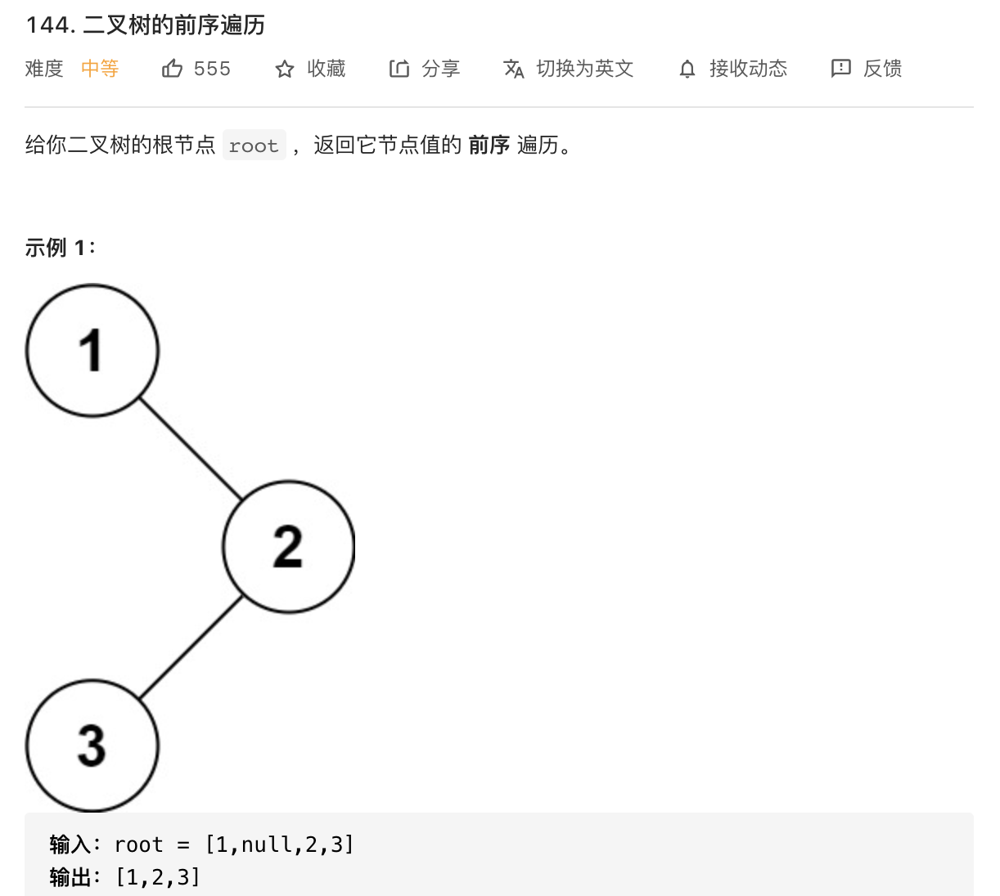
> 前序遍历就是中左右的顺序
递归法
- 时间复杂度为 **O(n)** ，空间复杂度为 **O(n)**

```cpp
/**
 * Definition for a binary tree node.
 * struct TreeNode {
 *     int val;
 *     TreeNode *left;
 *     TreeNode *right;
 *     TreeNode() : val(0), left(nullptr), right(nullptr) {}
 *     TreeNode(int x) : val(x), left(nullptr), right(nullptr) {}
 *     TreeNode(int x, TreeNode *left, TreeNode *right) : val(x), left(left), right(right) {}
 * };
 */
class Solution {
public:
    vector<int> res;

    vector<int> preorderTraversal(TreeNode* root) {
        if (!root) return res;
        res.push_back(root->val);
        preorderTraversal(root->left);
        preorderTraversal(root->right);
        return res;
    }
};
```

迭代法
- 时间复杂度为 **O(n)** ，空间复杂度为 **O(n)**

```cpp
/**
 * Definition for a binary tree node.
 * struct TreeNode {
 *     int val;
 *     TreeNode *left;
 *     TreeNode *right;
 *     TreeNode() : val(0), left(nullptr), right(nullptr) {}
 *     TreeNode(int x) : val(x), left(nullptr), right(nullptr) {}
 *     TreeNode(int x, TreeNode *left, TreeNode *right) : val(x), left(left), right(right) {}
 * };
 */
class Solution {
public:
    vector<int> preorderTraversal(TreeNode* root) 
    {
        vector<int> res;
        if(!root) 
            return res;
        stack<TreeNode*> stk;
        stk.push(root);
        while(!stk.empty())
        {
            TreeNode* tmp = stk.top();
            stk.pop();
            res.push_back(tmp -> val);
            if (tmp->right)
                stk.push(tmp->right);
            if (tmp->left)
                stk.push(tmp->left);
        }
        return res; 
    }
};
```

### 2. 中序遍历
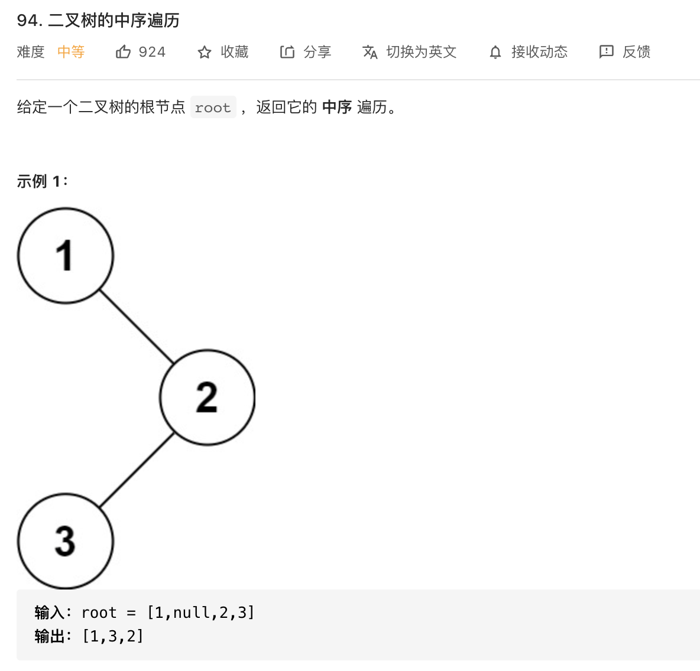
> 中序遍历就是左中右的顺序
递归法
- 时间复杂度为 **O(n)** ，空间复杂度为 **O(n)**

```cpp
/**
 * Definition for a binary tree node.
 * struct TreeNode {
 *     int val;
 *     TreeNode *left;
 *     TreeNode *right;
 *     TreeNode() : val(0), left(nullptr), right(nullptr) {}
 *     TreeNode(int x) : val(x), left(nullptr), right(nullptr) {}
 *     TreeNode(int x, TreeNode *left, TreeNode *right) : val(x), left(left), right(right) {}
 * };
 */
class Solution {
public:
    vector<int> result;
    vector<int> inorderTraversal(TreeNode* root) 
    {
        if (root == nullptr)
            return result;
        inorderTraversal(root->left);
        result.push_back(root->val);
        inorderTraversal(root->right);
        return result;
    }
};
```

迭代法
- 时间复杂度为 **O(n)** ，空间复杂度为 **O(n)**

```cpp
/**
 * Definition for a binary tree node.
 * struct TreeNode {
 *     int val;
 *     TreeNode *left;
 *     TreeNode *right;
 *     TreeNode() : val(0), left(nullptr), right(nullptr) {}
 *     TreeNode(int x) : val(x), left(nullptr), right(nullptr) {}
 *     TreeNode(int x, TreeNode *left, TreeNode *right) : val(x), left(left), right(right) {}
 * };
 */
class Solution {
public:
    vector<int> inorderTraversal(TreeNode* root) 
    {
        vector<int> res;
        stack<TreeNode*> stk;
        while (root != nullptr || !stk.empty()) 
        {
            while (root != nullptr) 
            {
                stk.push(root);
                root = root->left;
            }
            root = stk.top();
            stk.pop();
            res.push_back(root->val);
            root = root->right;
        }
        return res;
    }
};
```

### 3. 后序遍历
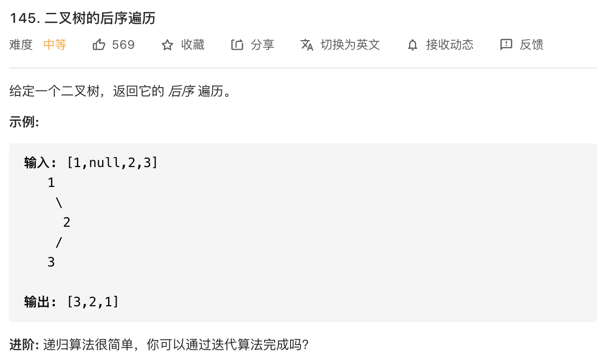
> 后序遍历就是左右中的顺序
递归法
- 时间复杂度为 **O(n)** ，空间复杂度为 **O(n)**

```cpp
/**
 * Definition for a binary tree node.
 * struct TreeNode {
 *     int val;
 *     TreeNode *left;
 *     TreeNode *right;
 *     TreeNode() : val(0), left(nullptr), right(nullptr) {}
 *     TreeNode(int x) : val(x), left(nullptr), right(nullptr) {}
 *     TreeNode(int x, TreeNode *left, TreeNode *right) : val(x), left(left), right(right) {}
 * };
 */
class Solution {
public:
    vector<int> res;
    vector<int> postorderTraversal(TreeNode* root) 
    {
        if (root == nullptr)
            return res;
        postorderTraversal(root->left);
        postorderTraversal(root->right);
        res.push_back(root->val);
        return res;
    }
};
```

迭代法
- 时间复杂度为 **O(n)** ，空间复杂度为 **O(n)**
> 实际上前序是中左右，修改一下写法变为中右左的顺序，在反转一下就可以得到后序遍历了

```cpp
/**
 * Definition for a binary tree node.
 * struct TreeNode {
 *     int val;
 *     TreeNode *left;
 *     TreeNode *right;
 *     TreeNode() : val(0), left(nullptr), right(nullptr) {}
 *     TreeNode(int x) : val(x), left(nullptr), right(nullptr) {}
 *     TreeNode(int x, TreeNode *left, TreeNode *right) : val(x), left(left), right(right) {}
 * };
 */
class Solution {
public:
    vector<int> postorderTraversal(TreeNode* root) 
    {
        vector<int> res;
        if(!root) 
            return res;
        stack<TreeNode*> stk;
        stk.push(root);
        while(!stk.empty())
        {
            TreeNode* tmp = stk.top();
            stk.pop();
            res.push_back(tmp -> val);
            if (tmp->left)
                stk.push(tmp->left);
            if (tmp->right)
                stk.push(tmp->right);
        }
        reverse(res.begin(), res.end());
        return res;
    }
};
```

### 4. 三种遍历迭代法的统一写法
实际上三种遍历的方式就是根据树的递归性质得到的，通过迭代法进行三种遍历，实际上就是通过栈的数据结构对递归算法中的栈进行模拟。
> 统一写法的关键在于使用一个NULL节点将遍历节点与处理元素的矛盾化解
 
> 理解3点：以中序遍历为例：
> 1. 栈的特性入栈和出栈顺序相反，想要输出顺序左中右，入栈顺序必须按照右中左。
> 2. 入栈的处理：可以把整颗树简化为3个节点一组的多个子树。即(父节点，左孩子，右孩子)这3个节点组成的子树。每次循环处理的实际就是将这样的3个节点按照规则顺序(右中左)进行入栈。所以才有了代码中看到的：每次都是先将栈顶元素去除，然后对以栈顶元素做为父节点的3个节点子树按规则顺序（右中左）入栈。
> 3. NULL节点的加入和出栈规则的规定：保证了当左孩子作为栈顶元素时，不会立即出栈，而是会将当前的左孩子(即栈顶元素)作为下次遍历的父节点接着按照规则顺序入栈。直到当前的左孩子做为父节点再无孩子时(无孩子时，入栈规则就成了(父节点,NULL节点))，遇到NULL节点了，才进行出栈。这样就保证了左孩子先出栈

- 中序遍历

```cpp
/**
 * Definition for a binary tree node.
 * struct TreeNode {
 *     int val;
 *     TreeNode *left;
 *     TreeNode *right;
 *     TreeNode() : val(0), left(nullptr), right(nullptr) {}
 *     TreeNode(int x) : val(x), left(nullptr), right(nullptr) {}
 *     TreeNode(int x, TreeNode *left, TreeNode *right) : val(x), left(left), right(right) {}
 * };
 */
class Solution {
public:
    vector<int> inorderTraversal(TreeNode* root) 
    {
        vector<int> res;
        stack<TreeNode*> stk;
        if (root)
            stk.push(root);
        while (!stk.empty()) 
        {
            TreeNode* node = stk.top();
            if (node != nullptr) 
            {
                stk.pop();
                //顺序要求为左中右，所以按右中压栈
                if (node->right)
                    stk.push(node->right);
                stk.push(node);
                stk.push(nullptr);
                if (node->left)
                    stk.push(node->left);
            }
            else
            {
                stk.pop();
                res.push_back(stk.top()->val);
                stk.pop();
            }
        }
        return res;
    }
};
```

- 前序遍历

```cpp
/**
 * Definition for a binary tree node.
 * struct TreeNode {
 *     int val;
 *     TreeNode *left;
 *     TreeNode *right;
 *     TreeNode() : val(0), left(nullptr), right(nullptr) {}
 *     TreeNode(int x) : val(x), left(nullptr), right(nullptr) {}
 *     TreeNode(int x, TreeNode *left, TreeNode *right) : val(x), left(left), right(right) {}
 * };
 */
class Solution {
public:
    vector<int> preorderTraversal(TreeNode* root) 
    {
        vector<int> res;
        stack<TreeNode*> stk;
        if (root)
            stk.push(root);
        while (!stk.empty()) 
        {
            TreeNode* node = stk.top();
            if (node != nullptr) 
            {
                stk.pop();
                //顺序要求为中左右，所以按右左中压栈
                if (node->right)
                    stk.push(node->right);
                if (node->left)
                    stk.push(node->left);
                stk.push(node);
                stk.push(nullptr);
            }
            else
            {
                stk.pop();
                res.push_back(stk.top()->val);
                stk.pop();
            }
        }
        return res;
    }
};
```

- 后序遍历

```cpp
/**
 * Definition for a binary tree node.
 * struct TreeNode {
 *     int val;
 *     TreeNode *left;
 *     TreeNode *right;
 *     TreeNode() : val(0), left(nullptr), right(nullptr) {}
 *     TreeNode(int x) : val(x), left(nullptr), right(nullptr) {}
 *     TreeNode(int x, TreeNode *left, TreeNode *right) : val(x), left(left), right(right) {}
 * };
 */
class Solution {
public:
    vector<int> postorderTraversal(TreeNode* root) 
    {
        vector<int> res;
        stack<TreeNode*> stk;
        if (root)
            stk.push(root);
        while (!stk.empty()) 
        {
            TreeNode* node = stk.top();
            if (node != nullptr) 
            {
                stk.pop();
                //顺序要求为左右中，所以按中右左压栈
                stk.push(node);
                stk.push(nullptr);
                if (node->right)
                    stk.push(node->right);
                if (node->left)
                    stk.push(node->left);

            }
            else
            {
                stk.pop();
                res.push_back(stk.top()->val);
                stk.pop();
            }
        }
        return res;
    }
};
```

### 5. 层序遍历
#### 5.1 层序遍历
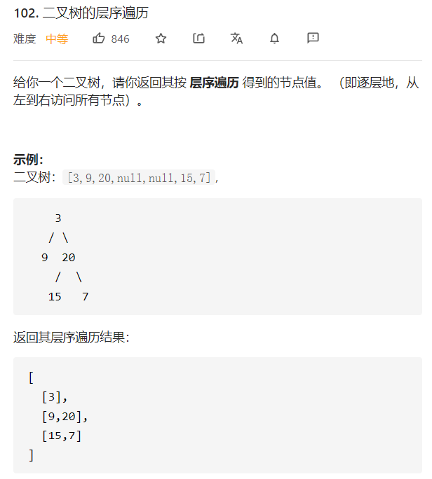
> 根据性质设置队列，通过分层计数的方式可以很容易的完成遍历
- 时间复杂度为 **O(n)** ，空间复杂度为 **O(n)**

```cpp
/**
 * Definition for a binary tree node.
 * struct TreeNode {
 *     int val;
 *     TreeNode *left;
 *     TreeNode *right;
 *     TreeNode() : val(0), left(nullptr), right(nullptr) {}
 *     TreeNode(int x) : val(x), left(nullptr), right(nullptr) {}
 *     TreeNode(int x, TreeNode *left, TreeNode *right) : val(x), left(left), right(right) {}
 * };
 */
class Solution {
public:
    vector<vector<int>> levelOrder(TreeNode* root) 
    {
        vector<vector<int>> res;
        queue<TreeNode*> que;
        if (root == nullptr)
            return res;
        que.push(root);
        while (!que.empty())
        {   
            vector<int> tmp;
            int size = que.size();
            while (size--)
            {
                TreeNode* node = que.front();
                que.pop();
                tmp.push_back(node->val);
                if (node->left)
                    que.push(node->left);
                if (node->right)
                    que.push(node->right);    
            }
            res.push_back(tmp);
        }
        return res;
    }
};
```

#### 5.2 二叉树的右视图
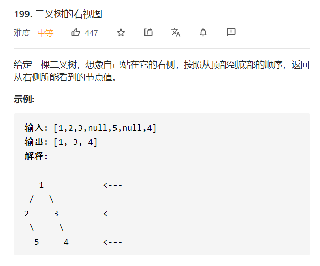
> 普通层序遍历的变体，每次只取每层的最后一个元素进vector
- 时间复杂度为 **O(n)** ，空间复杂度为 **O(n)**

```cpp
/**
 * Definition for a binary tree node.
 * struct TreeNode {
 *     int val;
 *     TreeNode *left;
 *     TreeNode *right;
 *     TreeNode() : val(0), left(nullptr), right(nullptr) {}
 *     TreeNode(int x) : val(x), left(nullptr), right(nullptr) {}
 *     TreeNode(int x, TreeNode *left, TreeNode *right) : val(x), left(left), right(right) {}
 * };
 */
class Solution {
public:
    vector<int> rightSideView(TreeNode* root) 
    {
        vector<int> res;
        queue<TreeNode*> que;
        if (root == nullptr)
            return res;
        que.push(root);
        while (!que.empty())
        {   
            int size = que.size();
            while (size--)
            {
                TreeNode* node = que.front();
                que.pop();
                if (size == 0)
                    res.push_back(node->val);
                if (node->left)
                    que.push(node->left);
                if (node->right)
                    que.push(node->right);    
            }
        }
        return res;
    }
};
```

其他层序遍历变体题序号：107， 637， 429

### 6. 反转二叉树
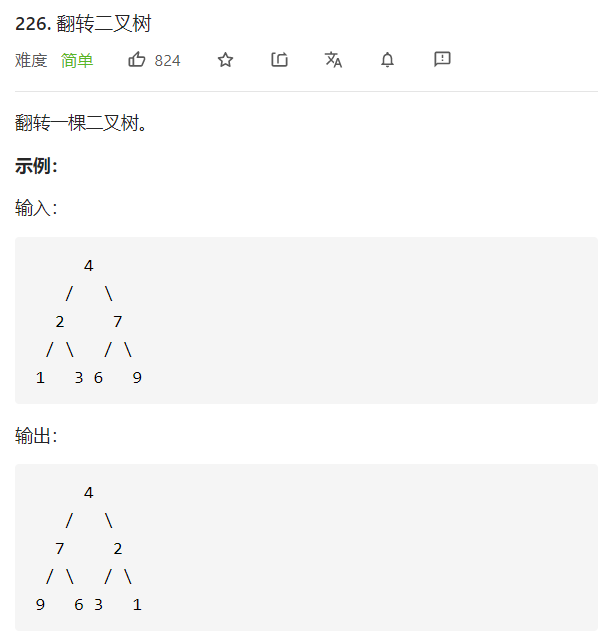
> 一道很有意思的简单题，其本质是树的遍历，只是树的遍历的操作从访问节点的数值变为了交换当前节点的左右孩子
> 前序，后序，层序，都可以，但是中序不可以，因为中序的访问顺序为左中右，对中间节点的左右孩子进行了交换之后，继续遍历右孩子节点时，实际上遍历的是未交换前的左孩子节点，所以对左孩子节点执行了两次交换，而右孩子节点没换，所以发生了错误
- 时间复杂度为 **O(n)** ，空间复杂度为 **O(n)**

```cpp
/**
 * Definition for a binary tree node.
 * struct TreeNode {
 *     int val;
 *     TreeNode *left;
 *     TreeNode *right;
 *     TreeNode() : val(0), left(nullptr), right(nullptr) {}
 *     TreeNode(int x) : val(x), left(nullptr), right(nullptr) {}
 *     TreeNode(int x, TreeNode *left, TreeNode *right) : val(x), left(left), right(right) {}
 * };
 */
class Solution {
public:
    TreeNode* invertTree(TreeNode* root) 
    {
        if (root == nullptr)
            return root;
        //此处为前序遍历代码，稍微改一下就可以得到后序遍历代码
        swap(root->left, root->right);
        invertTree(root->left);
        invertTree(root->right);

        return root;
    }
};

//该为层序遍历代码
class Solution {
public:
    TreeNode* invertTree(TreeNode* root) 
    {
        queue<TreeNode*> que;
        if (root == nullptr)
            return root;
        que.push(root);
        while (!que.empty())
        {
            TreeNode* node = que.front();
            que.pop();
            swap(node->left, node->right);
            if (node->left)
                que.push(node->left);
            if (node->right)
                que.push(node->right);
        }
        return root;
    }
};
```


## 二、二叉树的属性
### 1. 递归
#### 1.1 对称二叉树
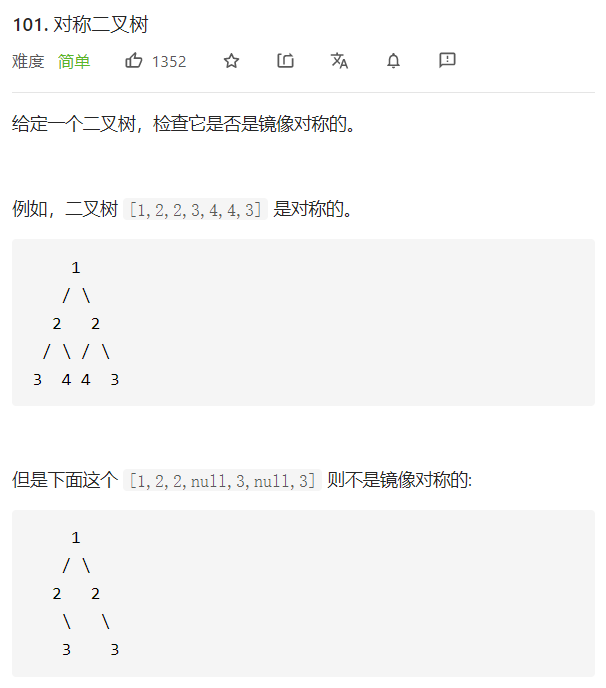
> 注意有返回值为bool类型的递归方法应该怎么写
> 实际上是对左子树的左右中遍历，对右子树的右左中的遍历同时进行，并完成比较的过程
- 时间复杂度为 **O(n)** ，空间复杂度为 **O(n)**

```cpp
/**
 * Definition for a binary tree node.
 * struct TreeNode {
 *     int val;
 *     TreeNode *left;
 *     TreeNode *right;
 *     TreeNode() : val(0), left(nullptr), right(nullptr) {}
 *     TreeNode(int x) : val(x), left(nullptr), right(nullptr) {}
 *     TreeNode(int x, TreeNode *left, TreeNode *right) : val(x), left(left), right(right) {}
 * };
 */
class Solution {
public:
    bool isSymmetric(TreeNode* root) 
    {
        if (root == nullptr)
            return true;
        return comp(root->left, root->right);
    }

    bool comp(TreeNode* left, TreeNode* right)
    {
        if (!left && !right)
            return true;
        if (left && right)
            return (left->val == right->val &&
                    comp(left->left, right->right) &&
                    comp(left->right, right->left));
        return false;
    }
};
```

#### 1.2 二叉树最大深度
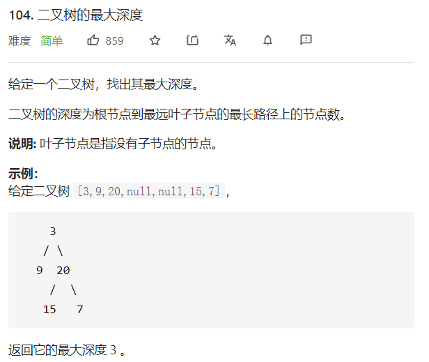
> 实际上可以看成是一种后序遍历
- 时间复杂度为 **O(n)** ，空间复杂度为 **O(n)**

```cpp
/**
 * Definition for a binary tree node.
 * struct TreeNode {
 *     int val;
 *     TreeNode *left;
 *     TreeNode *right;
 *     TreeNode() : val(0), left(nullptr), right(nullptr) {}
 *     TreeNode(int x) : val(x), left(nullptr), right(nullptr) {}
 *     TreeNode(int x, TreeNode *left, TreeNode *right) : val(x), left(left), right(right) {}
 * };
 */
class Solution {
public:
    int maxDepth(TreeNode* root) 
    {
        if (root == nullptr)
            return 0;
        return max(maxDepth(root->left), maxDepth(root->right)) + 1;
    }
};
```

#### 1.3 二叉树最小深度
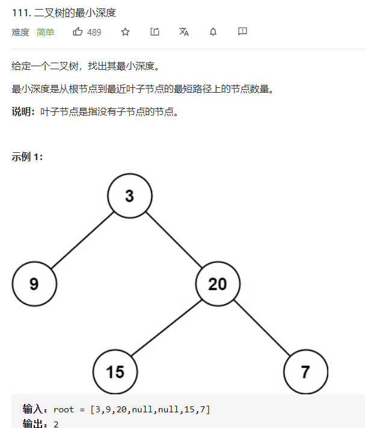
> 实际上可以看成是一种后序遍历，重要的是比起最大深度，要排除一个误区如代码所示
- 时间复杂度为 **O(n)** ，空间复杂度为 **O(n)**

```cpp
/**
 * Definition for a binary tree node.
 * struct TreeNode {
 *     int val;
 *     TreeNode *left;
 *     TreeNode *right;
 *     TreeNode() : val(0), left(nullptr), right(nullptr) {}
 *     TreeNode(int x) : val(x), left(nullptr), right(nullptr) {}
 *     TreeNode(int x, TreeNode *left, TreeNode *right) : val(x), left(left), right(right) {}
 * };
 */
class Solution {
public:
    int minDepth(TreeNode* root) 
    {
        //误区
        if (root == nullptr)
            return 0;
        if (!root->left && root->right)
            return minDepth(root->right) + 1;
        if (!root->right && root->left)
            return minDepth(root->left) + 1;
        
        return 1 + min(minDepth(root->left), minDepth(root->right));
    }
};
```

#### 1.4 平衡二叉树
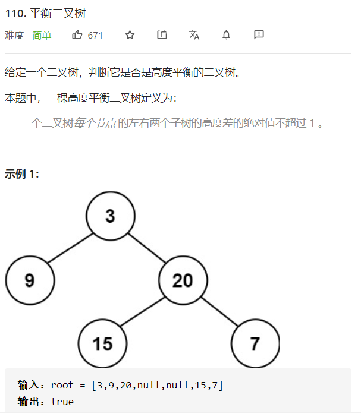
> 先求深度再判断，避免深度的重复求解
- 时间复杂度为 **O(n)** ，空间复杂度为 **O(n)**

```cpp
/**
 * Definition for a binary tree node.
 * struct TreeNode {
 *     int val;
 *     TreeNode *left;
 *     TreeNode *right;
 *     TreeNode() : val(0), left(nullptr), right(nullptr) {}
 *     TreeNode(int x) : val(x), left(nullptr), right(nullptr) {}
 *     TreeNode(int x, TreeNode *left, TreeNode *right) : val(x), left(left), right(right) {}
 * };
 */
class Solution {
public:
    int height(TreeNode* root)
    {
        if (root == NULL)
            return 0;
        int leftHeight = height(root->left);
        int rightHeight = height(root->right);
        if (leftHeight == -1 || rightHeight == -1 || abs(leftHeight - rightHeight) > 1)
            return -1;
        else
            return max(leftHeight, rightHeight) + 1;
    }

    bool isBalanced(TreeNode* root) 
    {
        return height(root) >= 0;
    }
};
```

### 2.隐藏在递归中的回溯
当需要遍历二叉树的多条路径时，需要根据判断条进行回溯，回到上一个节点；此时如果采用递归法的话，要记得，每一次递归后都需要一次回溯
#### 2.1 显示二叉树的所有路径
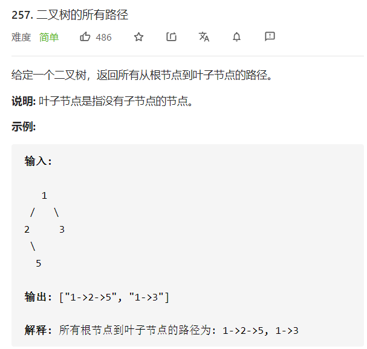
> 注意代码的回溯过程
- 时间复杂度为 **O(n)** ，空间复杂度为 **O(n)**

```cpp
/**
 * Definition for a binary tree node.
 * struct TreeNode {
 *     int val;
 *     TreeNode *left;
 *     TreeNode *right;
 *     TreeNode() : val(0), left(nullptr), right(nullptr) {}
 *     TreeNode(int x) : val(x), left(nullptr), right(nullptr) {}
 *     TreeNode(int x, TreeNode *left, TreeNode *right) : val(x), left(left), right(right) {}
 * };
 */
 //详细版
class Solution {
public:
    
    vector<string> binaryTreePaths(TreeNode* root) 
    {
        vector<int> path_int;
        vector<string> res;
        if (!root)
            return res;
        traverse(path_int, res, root);
        return res;
    }

    void traverse(vector<int>& path_int, vector<string>& res, TreeNode* root)
    {
        path_int.push_back(root->val);
        if (!root->left && !root->right)
        {   
            string path_string;
            for (int i = 0; i < path_int.size() - 1; i++)
                path_string = path_string + to_string(path_int[i]) + "->";
            path_string = path_string + to_string(path_int[path_int.size() - 1]);
            res.push_back(path_string);
        }

        if (root->left)
        {
            traverse(path_int, res, root->left);
            //递归代码会一直执行，直到遇到出口返回时，执行pop进行回溯
            path_int.pop_back();
        }
        if (root->right)
        {
            traverse(path_int, res, root->right);
            //递归代码会一直执行，直到遇到出口返回时，执行pop进行回溯
            path_int.pop_back();
        }
    }
};
```

```cpp
//简略版
class Solution {
public:
    
    vector<string> binaryTreePaths(TreeNode* root) 
    {
        vector<string> res;
        if (!root)
            return res;
        traverse("", res, root);
        return res;
    }

    void traverse(string path, vector<string>& res, TreeNode* root)
    {
        path = path + to_string(root->val);
        if (!root->left && !root->right)
            res.push_back(path);

        if (root->left)
        //回溯的过程隐藏在参数传递的过程中，传递的字符串参数是上一次计算出的path
        //也就是说每次递归回退时，栈中的path就是回溯之后的path了
            traverse(path + "->", res, root->left);
            
        if (root->right)
            traverse(path + "->", res, root->right);
    }
};
```

```cpp
//迭代法
class Solution {
public:
    
    vector<string> binaryTreePaths(TreeNode* root) 
    {
        vector<string> res;
        stack<string> path_stk;
        stack<TreeNode*> node_stk;
        if (!root)
            return res;
        path_stk.push(to_string(root->val));
        node_stk.push(root);
        while (!node_stk.empty())
        {   
            //迭代法实际上就是一种遍历的思想
            TreeNode* node = node_stk.top();
            node_stk.pop();
            string path = path_stk.top();
            path_stk.pop();
            if (!node->left && !node->right)
                res.push_back(path);

            if (node->left)
            {
                node_stk.push(node->left);
                path_stk.push(path + "->" + to_string(node->left->val));
            }
            if (node->right)
            {
                node_stk.push(node->right);
                path_stk.push(path + "->" + to_string(node->right->val));
            }
        }
        return res;
    }
};
```

## 三、构造二叉树
### 1. 由遍历数组重构二叉树
#### 1.1 中序遍历后序遍历序列构造二叉树
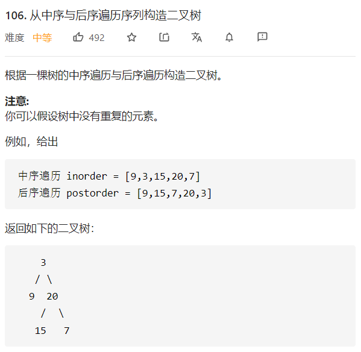
> 实际上要做的就是递归的分割遍历序列
- 时间复杂度为 **O(n)** ，空间复杂度为 **O(n)**

```cpp
/**
 * Definition for a binary tree node.
 * struct TreeNode {
 *     int val;
 *     TreeNode *left;
 *     TreeNode *right;
 *     TreeNode() : val(0), left(nullptr), right(nullptr) {}
 *     TreeNode(int x) : val(x), left(nullptr), right(nullptr) {}
 *     TreeNode(int x, TreeNode *left, TreeNode *right) : val(x), left(left), right(right) {}
 * };
 */
class Solution {
public:
    TreeNode* buildTree(vector<int> inorder, vector<int> postorder) 
    {
        int size = postorder.size();
        int i;              
        if (size == 0)
            return nullptr;

        TreeNode* root = new TreeNode;
        root->val = postorder[size - 1];
        //寻找中序遍历序列中根节点的位置
        for (i = 0; i < size; i++)
        {
            if (inorder[i] == root->val)
                break;
        }
        
        vector<int> left_inorder(inorder.begin(), inorder.begin() + i);
        vector<int> right_inorder(inorder.begin() + i + 1, inorder.end());
        vector<int> left_postorder(postorder.begin(), postorder.begin() + left_inorder.size());
        vector<int> right_postorder(postorder.begin() + left_inorder.size(), postorder.end() - 1);
        root->left = buildTree(left_inorder, left_postorder);
        root->right = buildTree(right_inorder , right_postorder);
        return root;
    }
};
```

#### 1.2 中序遍历前序遍历序列构造二叉树
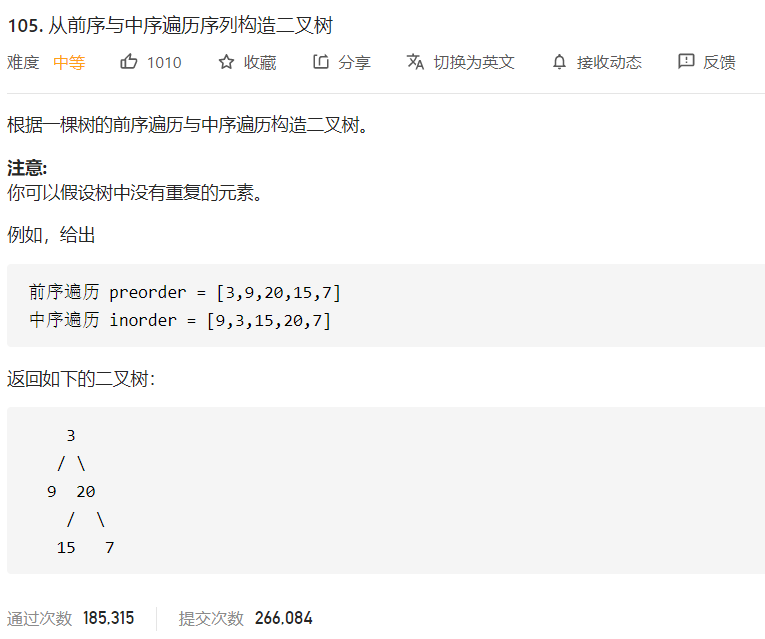
> 实际上要做的就是递归的分割遍历序列，与上题几乎一致
- 时间复杂度为 **O(n)** ，空间复杂度为 **O(n)**

```cpp
/**
 * Definition for a binary tree node.
 * struct TreeNode {
 *     int val;
 *     TreeNode *left;
 *     TreeNode *right;
 *     TreeNode() : val(0), left(nullptr), right(nullptr) {}
 *     TreeNode(int x) : val(x), left(nullptr), right(nullptr) {}
 *     TreeNode(int x, TreeNode *left, TreeNode *right) : val(x), left(left), right(right) {}
 * };
 */
class Solution {
public:
    TreeNode* buildTree(vector<int>& preorder, vector<int>& inorder) 
    {
        int size = preorder.size();
        int i;
        if (size == 0)
            return nullptr;
        TreeNode* root = new TreeNode(preorder[0]);
        for (i = 0; i < size; i++)
        {
            if (inorder[i] == root->val)
                break;
        }

        vector<int> left_inorder(inorder.begin(), inorder.begin() + i);
        vector<int> right_inorder(inorder.begin() + i + 1, inorder.end());
        vector<int> left_preorder(preorder.begin() + 1, preorder.begin() + 1 + left_inorder.size());
        vector<int> right_preorder(preorder.begin() + left_preorder.size() + 1, preorder.end());

        root->left = buildTree(left_preorder, left_inorder);
        root->right = buildTree(right_preorder, right_inorder);
        return root;
    }
};
```

### 2. 最大二叉树
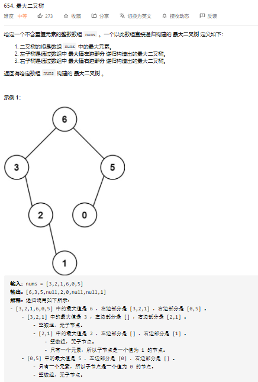
> 实际上要做的就是递归的分割遍历序列
- 时间复杂度为 **O(n^2)** ，空间复杂度为 **O(n)**

```cpp
/**
 * Definition for a binary tree node.
 * struct TreeNode {
 *     int val;
 *     TreeNode *left;
 *     TreeNode *right;
 *     TreeNode() : val(0), left(nullptr), right(nullptr) {}
 *     TreeNode(int x) : val(x), left(nullptr), right(nullptr) {}
 *     TreeNode(int x, TreeNode *left, TreeNode *right) : val(x), left(left), right(right) {}
 * };
 */
class Solution {
public:
    TreeNode* constructMaximumBinaryTree(vector<int>& nums) 
    {
        int size = nums.size();
        if (size == 0)
            return nullptr;
        int max_num = INT_MIN;
        int max_index = 0;
        for (int i = 0; i < size; i++)
        {
            if (nums[i] > max_num)
            {
                max_num = nums[i];
                max_index = i;
            }
        }

        TreeNode* root = new TreeNode(max_num);
        vector<int> left_nums(nums.begin(), nums.begin() + max_index);
        vector<int> right_nums(nums.begin() + max_index + 1, nums.end());
        root->left = constructMaximumBinaryTree(left_nums);
        root->right = constructMaximumBinaryTree(right_nums);
        return root;
    }
};
```

## 四、二叉搜索树
### 1. 搜索树的性质
#### 1.1 搜索过程
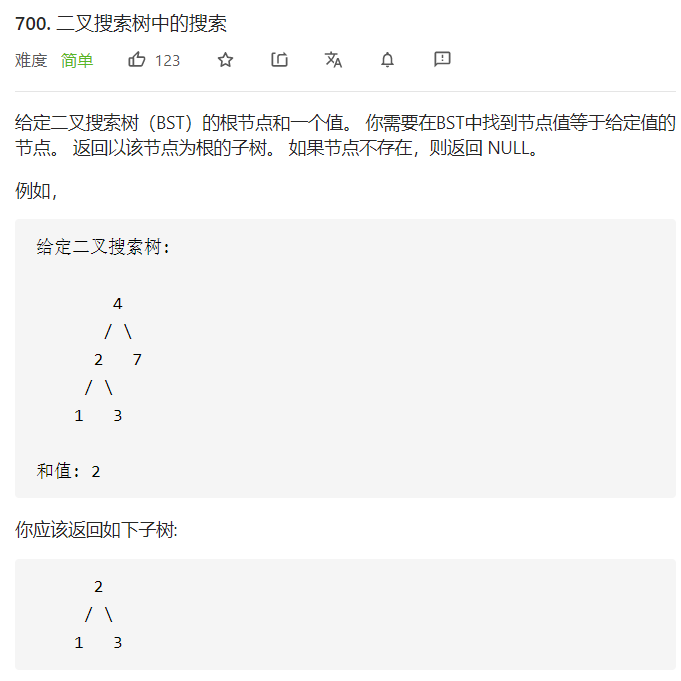
> 只需要正常的迭代判断就可以完成的简单任务
- 时间复杂度为 **O(logn)** ，空间复杂度为 **O(n)**

```cpp
/**
 * Definition for a binary tree node.
 * struct TreeNode {
 *     int val;
 *     TreeNode *left;
 *     TreeNode *right;
 *     TreeNode() : val(0), left(nullptr), right(nullptr) {}
 *     TreeNode(int x) : val(x), left(nullptr), right(nullptr) {}
 *     TreeNode(int x, TreeNode *left, TreeNode *right) : val(x), left(left), right(right) {}
 * };
 */
 //递归
class Solution {
public:

    TreeNode* searchBST(TreeNode* root, int val) 
    {
        if (root == nullptr || root->val == val)
            return root;
        if (root->val < val)
            return searchBST(root->right, val);
        if (root->val > val)
            return searchBST(root->left, val);

        return nullptr;
    }
};

//迭代
class Solution {
public:

    TreeNode* searchBST(TreeNode* root, int val) 
    {
        while (root)
        {
            if (root->val == val)
                return root;
            if (root->val > val)
                root = root->left;
            //这里一定要有else，因为有对root的赋值操作
            else if (root->val < val)
                root = root->right;
        }
        return nullptr;
    }
};
```

#### 1.2 判断搜索树
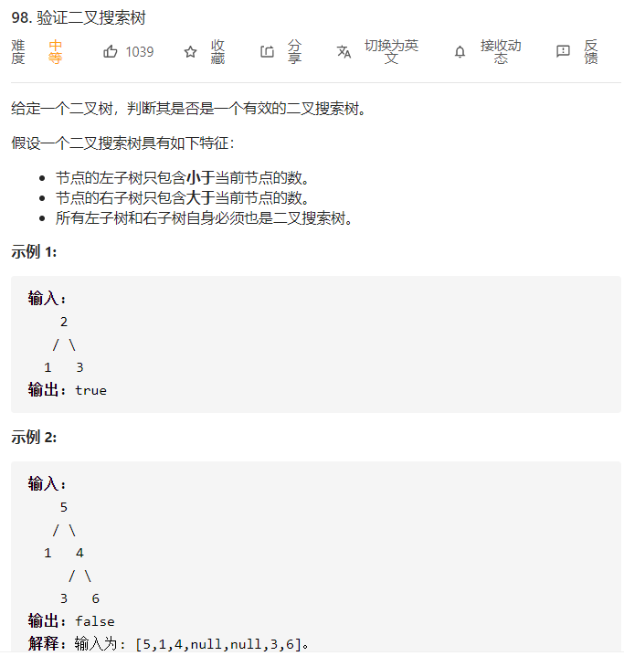
> 二叉搜索树进行中序遍历后实际上是一个有序的序列，所以对二叉搜索树的判断本质上就是一次中序遍历
- 时间复杂度为 **O(n)** ，空间复杂度为 **O(n)**

```cpp
/**
 * Definition for a binary tree node.
 * struct TreeNode {
 *     int val;
 *     TreeNode *left;
 *     TreeNode *right;
 *     TreeNode() : val(0), left(nullptr), right(nullptr) {}
 *     TreeNode(int x) : val(x), left(nullptr), right(nullptr) {}
 *     TreeNode(int x, TreeNode *left, TreeNode *right) : val(x), left(left), right(right) {}
 * };
 */
class Solution {
public:
    long max_val = LONG_MIN; 
    bool isValidBST(TreeNode* root) 
    {
        bool left_tree, right_tree;
        if (!root)
            return true;
        
        left_tree = isValidBST(root->left);
        if (max_val < root->val)
            max_val = root->val;
        else
            return false;
        right_tree = isValidBST(root->right);
        return left_tree && right_tree;
    }
};
```