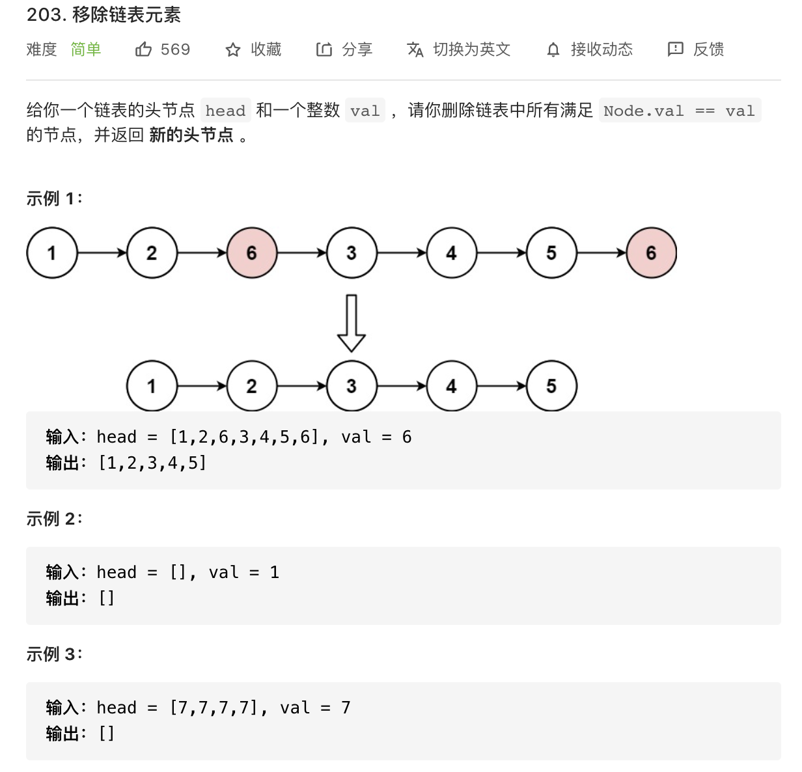
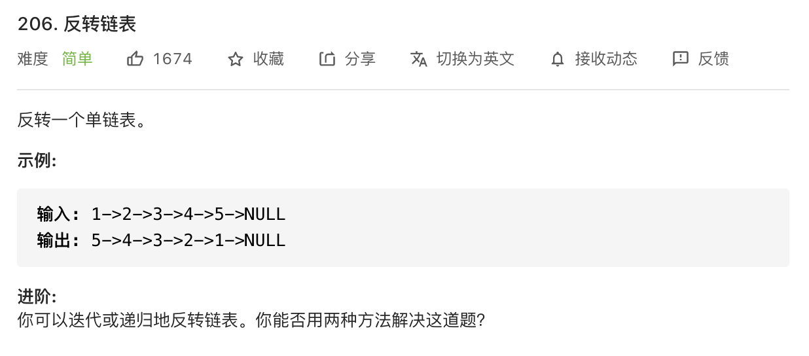
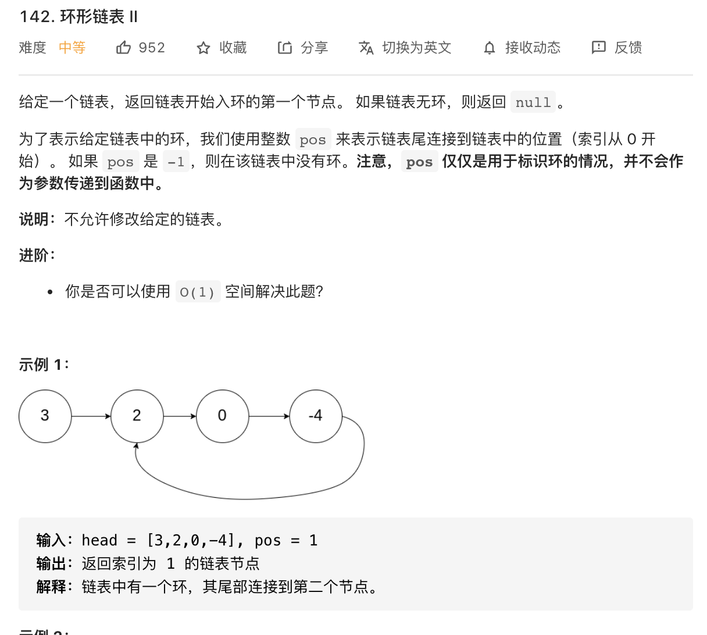

# <center>链表习题</center>

## 一、虚拟头节点
### 1. 移除链表元素

- 时间复杂度为 **O(n)**，空间复杂度为 **O(1)**
> 建立虚拟头节点让中间节点与头节点操作一致

```cpp
class Solution {
public:
    ListNode* removeElements(ListNode* head, int val) 
    {
        ListNode* vis_head = new ListNode;
        vis_head->next = head;
        ListNode* node = vis_head;
        while (node->next != nullptr)
        {
            if (node->next->val == val)
            {   
                ListNode* tmp = node->next;
                node->next = node->next->next;
                delete tmp;
            }
            else
                node = node->next;
        }
        return vis_head->next;
    }
};
```

## 二、双指针法
### 1. 反转链表

- 时间复杂度为 **O(n)**，空间复杂度为 **O(1)**
> 简单的双指针法

```cpp
/**
 * Definition for singly-linked list.
 * struct ListNode {
 *     int val;
 *     ListNode *next;
 *     ListNode() : val(0), next(nullptr) {}
 *     ListNode(int x) : val(x), next(nullptr) {}
 *     ListNode(int x, ListNode *next) : val(x), next(next) {}
 * };
 */
class Solution {
public:
    ListNode* reverseList(ListNode* head) 
    {
        //双指针法
        ListNode* first_ptr = nullptr;
        ListNode* last_ptr = head;
        ListNode* tmp;

        while (last_ptr != nullptr)
        {   
                tmp = last_ptr->next;
                last_ptr->next = first_ptr;
                first_ptr = last_ptr;  
                last_ptr = tmp;
        }
        return first_ptr;
    }
};
```

### 2. 环形链表2

- 时间复杂度为 **O(n)**，空间复杂度为 **O(1)**
> 1. 设计一个快指针，一个慢指针
> 2. 快指针一定先进入环中，如果快指针和慢指针相遇的话，一定是在环中相遇
> 3. 之后的问题在于找到环的入口
> 4. 由推导可知，环的入口即为相遇点

```cpp

/**
 * Definition for singly-linked list.
 * struct ListNode {
 *     int val;
 *     ListNode *next;
 *     ListNode(int x) : val(x), next(NULL) {}
 * };
 */
class Solution {
public:
    ListNode *detectCycle(ListNode *head) 
    {
        ListNode* first_ptr = head;
        ListNode* last_ptr = head;
        while (last_ptr != nullptr && last_ptr->next != nullptr)
        {
           first_ptr = first_ptr->next;
           last_ptr = last_ptr->next->next;
           if (first_ptr == last_ptr)
           {
               ListNode* t1 = head;
               ListNode* t2 = first_ptr;
               while (t1 != t2)
               {
                   t1 = t1->next;
                   t2 = t2->next;
               }
               return t1;
           }
        }

        return nullptr;     
    }
};
```