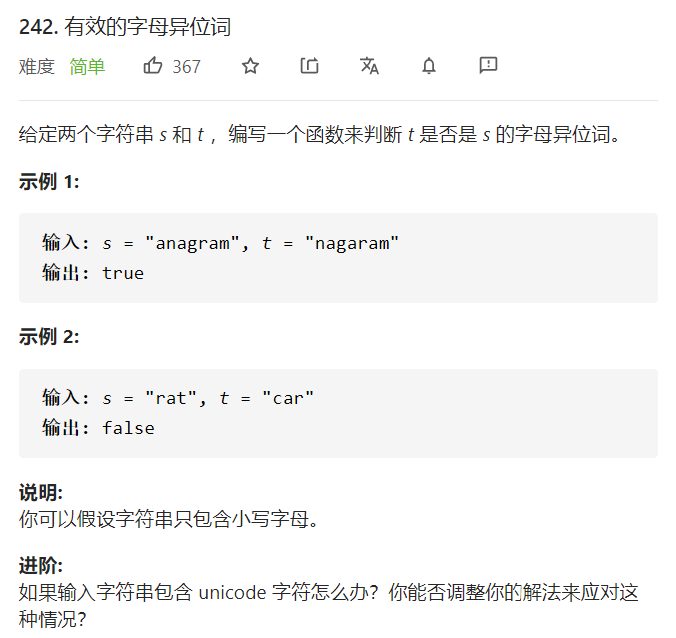
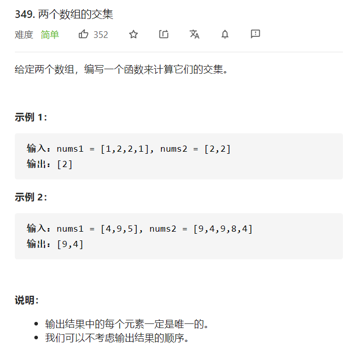
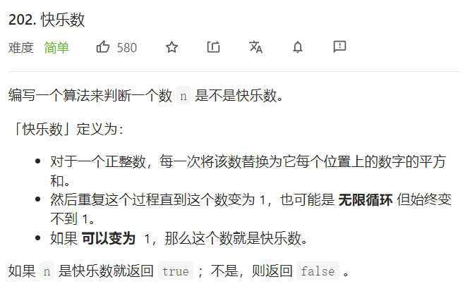
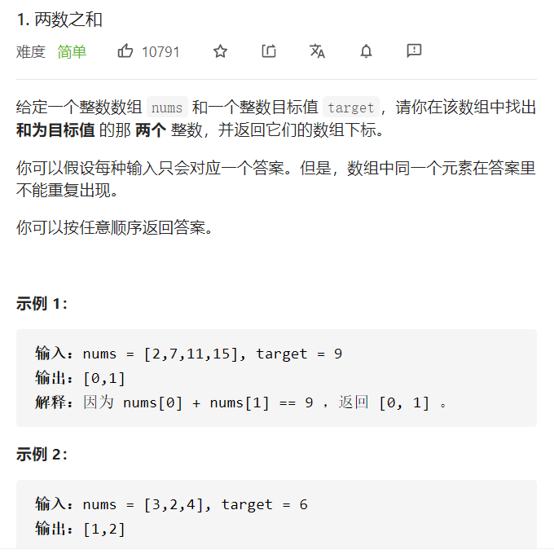
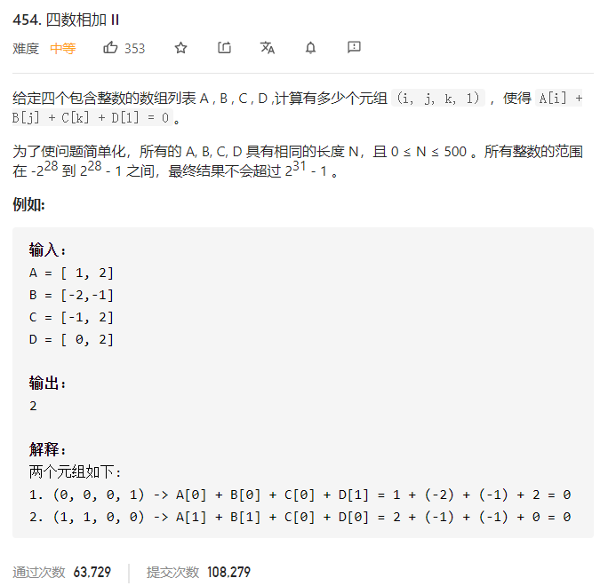
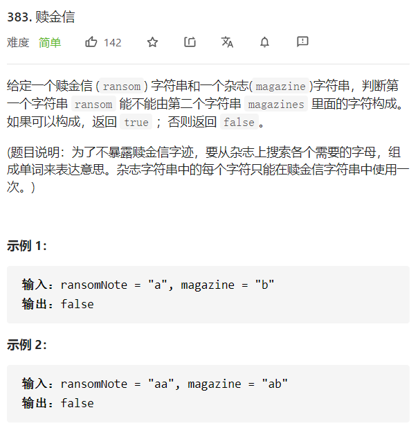

<!--
 * @Author: yinzhicun
 * @Date: 2021-04-10 23:18:09
 * @LastEditTime: 2021-04-12 21:20:47
 * @LastEditors: Please set LastEditors
 * @Description: In User Settings Edit
 * @FilePath: /Leetcode_Note/data_structure/note_chain.md
-->

# <center>哈希表习题</center>

## 一、数组做哈希表
### 1. 有效的字母异位词

- 时间复杂度为 **O(n)**，空间复杂度为 **O(1)**
> 1. 哈希表的相关习题往往背景都是已知一个集合，查找另一个集合
> 2. 所以操作也往往分为两步即存、查

```cpp
class Solution {
public:
    bool isAnagram(string s, string t) 
    {
        int index;
        int hash[26] = {0};

        for (auto& ch: s)
        {
            index = ch - 'a';
            hash[index]++;
        } 

        for (auto& ch: t)
        {
            index = ch - 'a';
            hash[index]--;
        }
        
        for (auto& count: hash)
        {
            if (count != 0)
                return false;
        }
        return true;
    } 
};
```

## 二、set
集合即不含重复元素
- std::set 底层为红黑树，有序
- std::multiset 底层为红黑树，有序
- std::unordered_set 底层为哈希表，无序
### 1. 求交集

- 时间复杂度为 **O(m+n)**，空间复杂度为 **O(m+n)**
> 普通的哈希表习题

```cpp
class Solution {
public:
    vector<int> intersection(vector<int>& nums1, vector<int>& nums2) 
    {
        unordered_set<int> result_set;
        unordered_set<int> nums_set(nums1.begin(), nums1.end());
        for (auto& num : nums2)
        {
            if (nums_set.find(num) != nums_set.end())
                result_set.insert(num);
        }
        return vector<int>(result_set.begin(), result_set.end());
    }
};
```

### 2. 快乐数

- 时间复杂度为 **O(log n)**，空间复杂度为 **O(log n)**

```cpp
class Solution {
public:
    bool isHappy(int n) 
    {
        unordered_set<int> hash;
        while (1)
        {
            int sum = getsum(n);
            if (sum == 1)
                return true;
            if (hash.find(sum) != hash.end())
                return false;
            else
                hash.insert(sum);
            n = sum;
        }
    }
    int getsum(int n)
    {
        int sum = 0;
        while (n)
        {
            sum = sum + (n % 10) * (n % 10);
            n = n / 10;
        }
        return sum;
    }
};
```

## 三、map
map的元素为键值对
- std::map 底层为红黑树，有序
- std::multimap 底层为红黑树，有序
- std::unordered_map 底层为哈希表，无序

### 1. 两数之和

- 时间复杂度为 **O(n)**，空间复杂度为 **O(n)**
> 相比于set，map可以记录每个值的下标（属性）

```cpp
class Solution {
public:
    vector<int> twoSum(vector<int>& nums, int target) 
    {
        unordered_map<int, int> hash;
        for (int i = 0; i < nums.size(); i++)
        {
            auto iter = hash.find(target - nums[i]);
            if (iter != hash.end())
            {
                vector<int> a;
                a.push_back(iter->second);
                a.push_back(i);
                return a;
            };
            hash.insert({nums[i], i});
        }
        return {};
    }
};
```

其余多数之和相关习题见[数组习题/几数之和](./note_array.md)

### 2. 四数之和2

- 时间复杂度为 **O(n^2)**，空间复杂度为 **O(n^2)**
> 相比于set，map可以记录每个值的下标（属性）

```cpp
class Solution {
public:
    int fourSumCount(vector<int>& A, vector<int>& B, vector<int>& C, vector<int>& D) 
    {
        unordered_map<int, int> map;
        int count = 0;

        for (int i = 0; i < A.size(); i++)
        {
            for (int j = 0; j < B.size(); j++)
            {
                int sum_AB = A[i] + B[j];
                auto iter = map.find(sum_AB);
                if (iter != map.end())
                {
                    iter->second++;
                }
                else
                {
                    map.insert({sum_AB, 1});
                }
            }
        }

        for (int i = 0; i < C.size(); i++)
        {
            for (int j = 0; j < D.size(); j++)
            {
                int sum_CD = C[i] + D[j];
                auto iter = map.find(0 - sum_CD);
                if (iter != map.end())
                {
                    count = count + iter->second; 
                }
            }
        }
        return count;
    }
};
```

其余多数之和相关习题见[数组习题/几数之和](./note_array.md)

### 3. 赎金信

- 时间复杂度为 **O(n)**，空间复杂度为 **O(m+n)**
> 相比于set，map可以记录每个值的下标（属性）

```cpp
class Solution {
public:
    bool canConstruct(string ransomNote, string magazine) 
    {
        unordered_map<char, int> map;
        for (auto ch : magazine)
        {   
            auto iter = map.find(ch);
            if (iter == map.end())
            {
                map.insert({ch, 1});
            }
            else
            {
                map[ch]++;
            }
        }

        for (auto ch : ransomNote)
        {
            auto iter = map.find(ch);
            if (iter == map.end())
            {
                return false;
            }
            else
            {
                if (map[ch] < 1)
                {
                    return false;
                }
                map[ch]--;
            }
        }
        return true;
    }
};
```