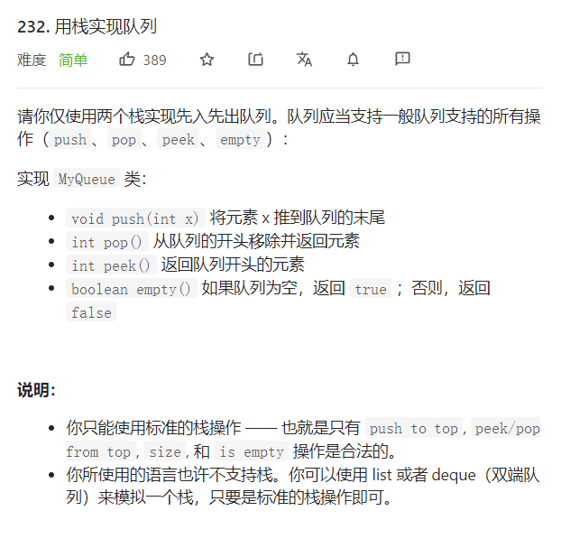
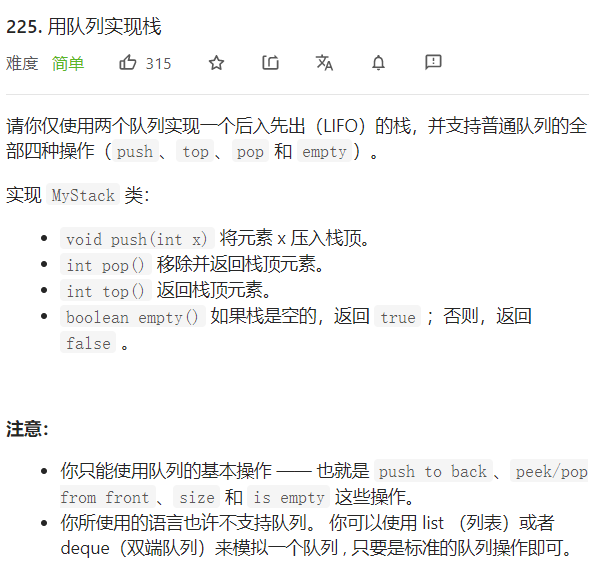
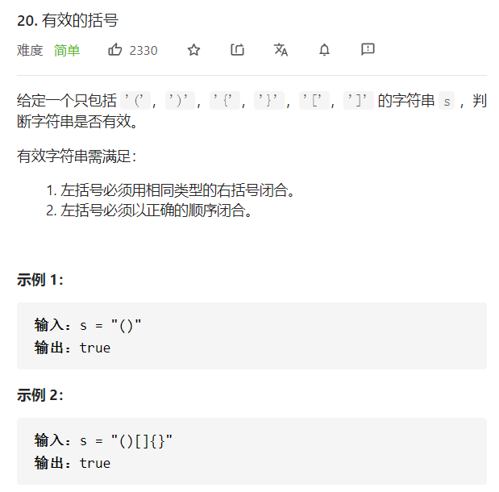

<!--
 * @Author: yinzhicun
 * @Date: 2021-04-14 09:56:51
 * @LastEditTime: 2021-04-14 11:02:44
 * @LastEditors: Please set LastEditors
 * @Description: In User Settings Edit
 * @FilePath: \Leetcode_Note\data_structure\note_queue_and_stack.md
-->
# <center>队列与栈习题</center>

## 一、概念理解加深
STL中queue和stack的底层实现可以指定，默认为dequeue模板
### 1. 用栈实现队列

> 1. 构建两个栈的数据结构stack_in, stack_out
> 2. 当有元素要进队时，stack_in进栈
> 3. 当有元素要出队时，stack_in元素全部出栈，顺序压入stack_out中，stack_out头元素出栈
> 4. 当两栈均为空时，即队列为空

```cpp
class MyQueue {
public:
    stack<int> stack_in;
    stack<int> stack_out; 
    /** Initialize your data structure here. */
    MyQueue() {}
    
    /** Push element x to the back of queue. */
    void push(int x) 
    {
        stack_in.push(x);
    }
    
    /** Removes the element from in front of queue and returns that element. */
    int pop() 
    {
        if (stack_out.empty())
        {
            while (!stack_in.empty())
            {
                //STL库里stack容器的返回值为void
                int temp = stack_in.top();
                stack_in.pop();
                stack_out.push(temp);
            }
        }
        int result = stack_out.top();
        stack_out.pop();
        return result;
    }
    
    /** Get the front element. */
    int peek() 
    {
        int result = this->pop();
        stack_out.push(result);
        return result;
    }
    
    /** Returns whether the queue is empty. */
    bool empty() 
    {
        if (stack_out.empty() && stack_in.empty())
            return true;
        return false;
    }
};
```

### 2. 用队列实现栈

> 1. 构建两个队列的数据结构que_in, que_backup
> 2. 当有元素要进栈时，que_in进队
> 3. 当有元素要出栈时，que_in除队尾元素元素在que_backup中备份，que_in元素全部出队，返回队尾元素
> 4. 当que_in为空时，即队列为空

```cpp
class MyStack {
public:
    queue<int> que_in;
    queue<int> que_backup;
    /** Initialize your data structure here. */
    MyStack() {}
    
    /** Push element x onto stack. */
    void push(int x) 
    {
        que_in.push(x);
    }
    
    /** Removes the element on top of the stack and returns that element. */
    int pop() 
    {
        int size = que_in.size();
        //留下队尾元素
        size--;
        //备份
        while (size--)
        {
            que_backup.push(que_in.front());
            que_in.pop();
        }
        int result = que_in.front();
        que_in.pop();
        //备份数据拷回
        que_in = que_backup;
        //清空备份队列
        while (!que_backup.empty())
            que_backup.pop();
        return result;
    }
    
    /** Get the top element. */
    int top() 
    {
        return que_in.back();
    }
    
    /** Returns whether the stack is empty. */
    bool empty() 
    {
        return que_in.empty();
    }
};
```

## 二、栈
### 1. 用栈解决匹配问题
#### 1.1 括号匹配

- 时间复杂度为 **O(n)** ，空间复杂度为 **O(n+m)**
> 1. 明确一起有三种不匹配的情况，左右括号多余或者括号不匹配
> 2. 当出现左括号时右括号压栈，当出现匹配的右括号时出栈

```cpp
class Solution {
public:
    bool isValid(string s) 
    {
        stack<char> string_stack;
        int flag[3] = {0};
        for (auto& c : s)
        {
            if (c == '(')
                string_stack.push(')');
            else if (c == '[')
                string_stack.push(']');
            else if (c == '{')
                string_stack.push('}');
            else if (!string_stack.empty() && c == string_stack.top())    
                string_stack.pop();
            else
                return false;
        }
        return string_stack.empty();
    }
};
```